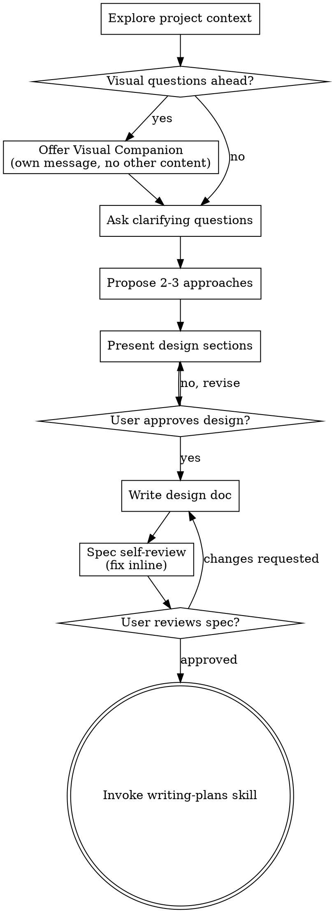

# Brainstorming Ideas Into Designs

Turn ideas into full designs/specs via collaborative dialogue.

Start: understand project context. Ask questions one at time to refine. Once clear, present design, get approval.

<HARD-GATE>
Do NOT invoke any implementation skill, write any code, scaffold any project, or take any implementation action until you have presented a design and the user has approved it. This applies to EVERY project regardless of perceived simplicity.
</HARD-GATE>

## Anti-Pattern: "This Is Too Simple To Need A Design"

Every project go through process. Todo list, single-fn util, config change — all. "Simple" projects = where unexamined assumptions waste most work. Design can be short (few sentences), but MUST present + get approval.

## Checklist

MUST create task per item, complete in order:

1. **Explore project context** — files, docs, recent commits
2. **Offer visual companion** (if visual questions ahead) — own message, not combined w/ clarifying question. See Visual Companion below.
3. **Ask clarifying questions** — one at time, understand purpose/constraints/success criteria
4. **Propose 2-3 approaches** — trade-offs + recommendation
5. **Present design** — sections scaled to complexity, get approval per section
6. **Write design doc** — save to `docs/superpowers/specs/YYYY-MM-DD-<topic>-design.md`, commit
7. **Spec self-review** — inline check: placeholders, contradictions, ambiguity, scope (see below)
8. **User reviews written spec** — ask user review spec file before proceeding
9. **Transition to implementation** — invoke writing-plans skill for impl plan

## Process Flow

**Terminal state = invoke writing-plans.** Do NOT invoke frontend-design, mcp-builder, or other impl skill. ONLY skill after brainstorming = writing-plans.

## The Process

**Understanding idea:**

- Check current project state first (files, docs, recent commits)
- Before detailed questions, assess scope: if request = multiple independent subsystems (e.g., "platform w/ chat, file storage, billing, analytics"), flag immediately. Don't refine details of project needing decomposition.
- If too large for single spec, decompose into sub-projects: independent pieces, relations, build order. Brainstorm first sub-project via normal flow. Each sub-project → own spec → plan → impl cycle.
- For appropriately-scoped projects, ask one at time
- Multiple choice preferred, open-ended OK
- One question per message — break topics needing more exploration into multiple questions
- Focus: purpose, constraints, success criteria

**Exploring approaches:**

- Propose 2-3 approaches w/ trade-offs
- Present conversationally w/ recommendation + reasoning
- Lead w/ recommended option, explain why

**Presenting design:**

- Once understood, present design
- Scale each section to complexity: few sentences if straightforward, up to 200-300 words if nuanced
- Ask after each section if right so far
- Cover: architecture, components, data flow, error handling, testing
- Ready to go back + clarify if needed

**Design for isolation + clarity:**

- Break system into smaller units, each one clear purpose, communicate via well-defined interfaces, understandable + testable independently
- Per unit, must answer: what does it do, how use it, what depend on?
- Can someone understand unit w/o reading internals? Can change internals w/o breaking consumers? If no, boundaries need work.
- Smaller well-bounded units = easier for you too — reason better about code held in context, edits more reliable when files focused. Large file = signal doing too much.

**Working in existing codebases:**

- Explore current structure before proposing changes. Follow existing patterns.
- Where existing code has problems affecting work (e.g., file too large, unclear boundaries, tangled responsibilities), include targeted improvements in design — like good dev improves code they work in.
- Don't propose unrelated refactoring. Stay focused on current goal.

## After the Design

**Documentation:**

- Write validated design (spec) to `docs/superpowers/specs/YYYY-MM-DD-<topic>-design.md`
  - (User preferences for spec location override default)
- Use elements-of-style:writing-clearly-and-concisely skill if available
- Commit design doc to git

**Spec Self-Review:**
After writing spec, look w/ fresh eyes:

1. **Placeholder scan:** Any "TBD", "TODO", incomplete sections, vague requirements? Fix.
2. **Internal consistency:** Sections contradict? Architecture match feature descriptions?
3. **Scope check:** Focused enough for single impl plan, or needs decomposition?
4. **Ambiguity check:** Any requirement interpretable 2 ways? Pick one, make explicit.

Fix inline. No re-review — fix + move on.

**User Review Gate:**
After spec review loop passes, ask user review written spec before proceeding:

> "Spec written and committed to `<path>`. Please review it and let me know if you want to make any changes before we start writing out the implementation plan."

Wait for response. If changes requested, make + re-run spec review loop. Only proceed once approved.

**Implementation:**

- Invoke writing-plans skill for detailed impl plan
- Do NOT invoke other skill. writing-plans = next step.

## Key Principles

- **One question at a time** - No overwhelm w/ multiple
- **Multiple choice preferred** - Easier than open-ended when possible
- **YAGNI ruthlessly** - Remove unnecessary features from all designs
- **Explore alternatives** - Always 2-3 approaches before settling
- **Incremental validation** - Present design, approval before moving on
- **Be flexible** - Go back + clarify when needed

## Visual Companion

Browser-based companion for mockups, diagrams, visual options during brainstorming. Tool — not mode. Accepting = available for visual questions; does NOT mean every question goes through browser.

**Offering companion:** When upcoming questions involve visual content (mockups, layouts, diagrams), offer once for consent:
> "Some of what we're working on might be easier to explain if I can show it to you in a web browser. I can put together mockups, diagrams, comparisons, and other visuals as we go. This feature is still new and can be token-intensive. Want to try it? (Requires opening a local URL)"

**Offer MUST be own message.** No clarifying questions, context summaries, other content. Message contains ONLY offer + nothing else. Wait for response before continuing. If decline, proceed text-only.

**Per-question decision:** Even after accept, decide PER QUESTION: browser or terminal. Test: **would user understand better by seeing than reading?**

- **Browser** for visual content — mockups, wireframes, layout comparisons, architecture diagrams, side-by-side visual designs
- **Terminal** for text — requirements questions, conceptual choices, tradeoff lists, A/B/C/D text options, scope decisions

UI topic question ≠ visual question. "What does personality mean in this context?" = conceptual → terminal. "Which wizard layout works better?" = visual → browser.

If agree to companion, read detailed guide before proceeding:
`skills/brainstorming/visual-companion.md`