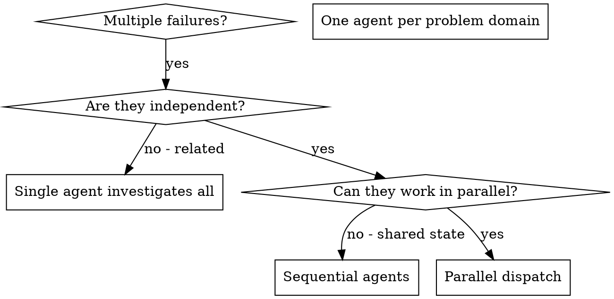

# Dispatching Parallel Agents

## Overview

Delegate tasks to specialized agents w/ isolated context. Craft instructions + context precise → stay focused, succeed. Never inherit your session context/history — construct exactly what need. Preserves your context for coordination.

Multiple unrelated failures (different test files, subsystems, bugs) → sequential investigation wastes time. Each independent → parallel.

**Core principle:** One agent per independent problem domain. Concurrent.

## When to Use



**Use when:**
- 3+ test files fail w/ different root causes
- Multiple subsystems broken independently
- Each problem understandable w/o context from others
- No shared state between investigations

**Don't use when:**
- Failures related (fix one → fix others)
- Need full system state
- Agents interfere

## The Pattern

### 1. Identify Independent Domains

Group failures by what broken:
- File A tests: Tool approval flow
- File B tests: Batch completion behavior
- File C tests: Abort functionality

Each domain independent — fix tool approval ≠ affect abort tests.

### 2. Create Focused Agent Tasks

Each agent gets:
- **Specific scope:** One test file/subsystem
- **Clear goal:** Make these tests pass
- **Constraints:** Don't change other code
- **Expected output:** Summary of found + fixed

### 3. Dispatch in Parallel

```typescript
// In Claude Code / AI environment
Task("Fix agent-tool-abort.test.ts failures")
Task("Fix batch-completion-behavior.test.ts failures")
Task("Fix tool-approval-race-conditions.test.ts failures")
// All three run concurrently
```

### 4. Review and Integrate

Agents return →
- Read each summary
- Verify fixes no conflict
- Run full test suite
- Integrate all changes

## Agent Prompt Structure

Good prompts:
1. **Focused** — One problem domain
2. **Self-contained** — All context needed
3. **Specific about output** — What return?

```markdown
Fix the 3 failing tests in src/agents/agent-tool-abort.test.ts:

1. "should abort tool with partial output capture" - expects 'interrupted at' in message
2. "should handle mixed completed and aborted tools" - fast tool aborted instead of completed
3. "should properly track pendingToolCount" - expects 3 results but gets 0

These are timing/race condition issues. Your task:

1. Read the test file and understand what each test verifies
2. Identify root cause - timing issues or actual bugs?
3. Fix by:
   - Replacing arbitrary timeouts with event-based waiting
   - Fixing bugs in abort implementation if found
   - Adjusting test expectations if testing changed behavior

Do NOT just increase timeouts - find the real issue.

Return: Summary of what you found and what you fixed.
```

## Common Mistakes

**❌ Too broad:** "Fix all the tests" — agent lost
**✅ Specific:** "Fix agent-tool-abort.test.ts" — focused scope

**❌ No context:** "Fix the race condition" — agent no know where
**✅ Context:** Paste error messages + test names

**❌ No constraints:** Agent refactor everything
**✅ Constraints:** "Do NOT change production code" / "Fix tests only"

**❌ Vague output:** "Fix it" — no know what changed
**✅ Specific:** "Return summary of root cause and changes"

## When NOT to Use

**Related failures:** Fix one → fix others. Investigate together first
**Need full context:** Understanding requires entire system
**Exploratory debugging:** Don't know what broken yet
**Shared state:** Agents interfere (same files, same resources)

## Real Example from Session

**Scenario:** 6 test failures across 3 files after major refactor

**Failures:**
- agent-tool-abort.test.ts: 3 failures (timing)
- batch-completion-behavior.test.ts: 2 failures (tools not exec)
- tool-approval-race-conditions.test.ts: 1 failure (exec count = 0)

**Decision:** Independent domains — abort logic ≠ batch completion ≠ race conditions

**Dispatch:**
```
Agent 1 → Fix agent-tool-abort.test.ts
Agent 2 → Fix batch-completion-behavior.test.ts
Agent 3 → Fix tool-approval-race-conditions.test.ts
```

**Results:**
- Agent 1: Replaced timeouts w/ event-based waiting
- Agent 2: Fixed event structure bug (threadId wrong place)
- Agent 3: Added wait for async tool exec complete

**Integration:** All fixes independent, no conflicts, full suite green

**Time saved:** 3 problems solved parallel vs sequential

## Key Benefits

1. **Parallelization** — Multiple investigations simultaneous
2. **Focus** — Narrow scope, less context to track
3. **Independence** — No interference
4. **Speed** — 3 problems in time of 1

## Verification

Agents return →
1. **Review each summary** — Understand changes
2. **Check conflicts** — Same code edited?
3. **Run full suite** — All fixes work together
4. **Spot check** — Agents make systematic errors

## Real-World Impact

From debug session (2025-10-03):
- 6 failures across 3 files
- 3 agents dispatched parallel
- All investigations concurrent
- All fixes integrated
- Zero conflicts between agent changes