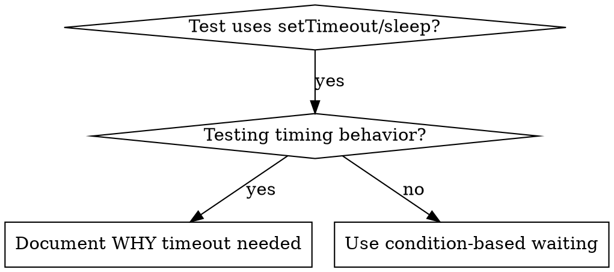

# Condition-Based Waiting

## Overview

Flaky tests guess timing with arbitrary delays. Race conditions → pass on fast machines, fail under load or CI.

**Core principle:** Wait for actual condition, not guess at duration.

## When to Use



**Use when:**
- Arbitrary delays (`setTimeout`, `sleep`, `time.sleep()`)
- Flaky tests (pass sometimes, fail under load)
- Timeout under parallel
- Waiting async ops

**Don't use when:**
- Testing timing behavior (debounce, throttle)
- Always document WHY if arbitrary timeout

## Core Pattern

```typescript
// ❌ BEFORE: Guessing at timing
await new Promise(r => setTimeout(r, 50));
const result = getResult();
expect(result).toBeDefined();

// ✅ AFTER: Waiting for condition
await waitFor(() => getResult() !== undefined);
const result = getResult();
expect(result).toBeDefined();
```

## Quick Patterns

| Scenario | Pattern |
|----------|---------|
| Wait for event | `waitFor(() => events.find(e => e.type === 'DONE'))` |
| Wait for state | `waitFor(() => machine.state === 'ready')` |
| Wait for count | `waitFor(() => items.length >= 5)` |
| Wait for file | `waitFor(() => fs.existsSync(path))` |
| Complex condition | `waitFor(() => obj.ready && obj.value > 10)` |

## Implementation

Generic polling fn:
```typescript
async function waitFor<T>(
  condition: () => T | undefined | null | false,
  description: string,
  timeoutMs = 5000
): Promise<T> {
  const startTime = Date.now();

  while (true) {
    const result = condition();
    if (result) return result;

    if (Date.now() - startTime > timeoutMs) {
      throw new Error(`Timeout waiting for ${description} after ${timeoutMs}ms`);
    }

    await new Promise(r => setTimeout(r, 10)); // Poll every 10ms
  }
}
```

See `condition-based-waiting-example.ts` here for full impl with domain helpers (`waitForEvent`, `waitForEventCount`, `waitForEventMatch`) from real debug session.

## Common Mistakes

**❌ Poll too fast:** `setTimeout(check, 1)` — wastes CPU
**✅ Fix:** Poll every 10ms

**❌ No timeout:** Loop forever
**✅ Fix:** Always timeout + clear error

**❌ Stale data:** Cache state before loop
**✅ Fix:** Call getter inside loop

## When Arbitrary Timeout IS Correct

```typescript
// Tool ticks every 100ms - need 2 ticks to verify partial output
await waitForEvent(manager, 'TOOL_STARTED'); // First: wait for condition
await new Promise(r => setTimeout(r, 200));   // Then: wait for timed behavior
// 200ms = 2 ticks at 100ms intervals - documented and justified
```

**Requirements:**
1. First wait for triggering condition
2. Based on known timing (not guess)
3. Comment WHY

## Real-World Impact

Debug session (2025-10-03):
- Fixed 15 flaky tests across 3 files
- Pass rate: 60% → 100%
- Exec time: 40% faster
- No more race conditions