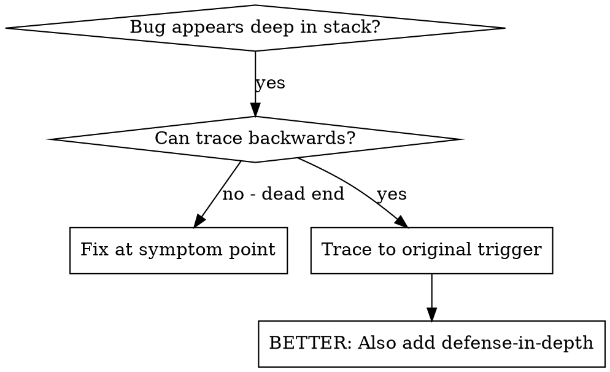
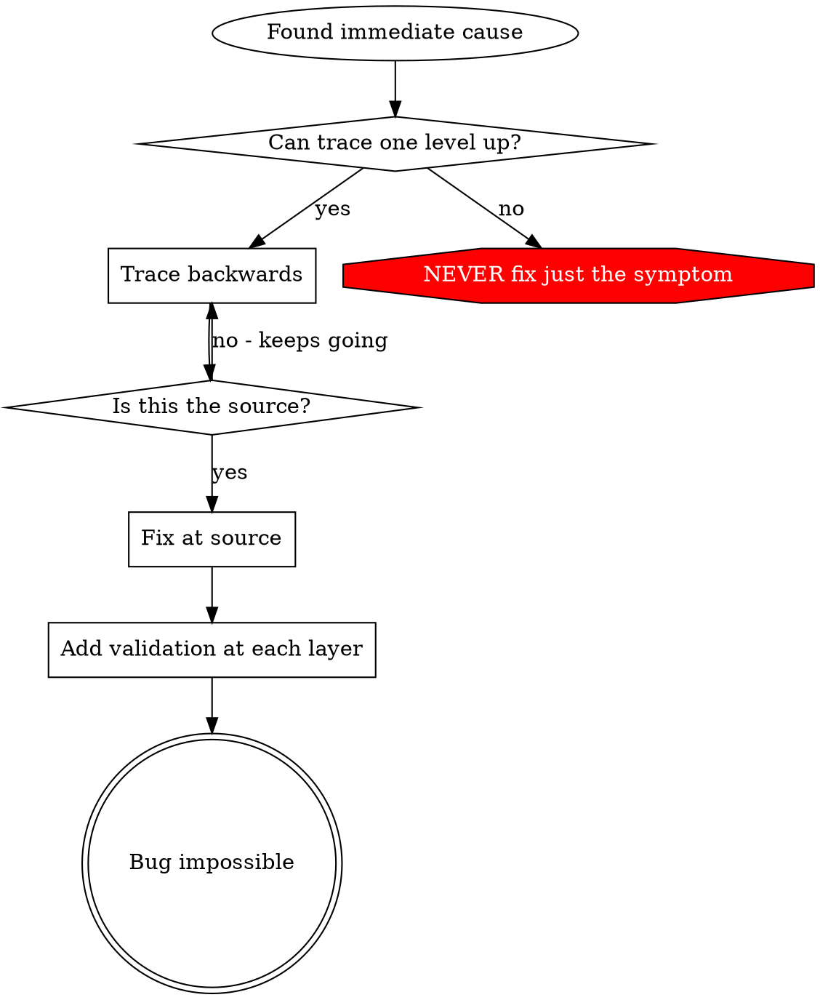

# Root Cause Tracing

## Overview

Bugs often manifest deep in call stack (git init wrong dir, file wrong location, DB wrong path). Instinct: fix where error appears. That treat symptom.

**Core principle:** Trace back through call chain to original trigger. Fix at source.

## When to Use



**Use when:**
- Error deep in exec (not entry)
- Stack trace long call chain
- Invalid data origin unclear
- Need find which test/code trigger

## The Tracing Process

### 1. Observe the Symptom
```
Error: git init failed in /Users/jesse/project/packages/core
```

### 2. Find Immediate Cause
**Code direct cause?**
```typescript
await execFileAsync('git', ['init'], { cwd: projectDir });
```

### 3. Ask: What Called This?
```typescript
WorktreeManager.createSessionWorktree(projectDir, sessionId)
  → called by Session.initializeWorkspace()
  → called by Session.create()
  → called by test at Project.create()
```

### 4. Keep Tracing Up
**Value passed?**
- `projectDir = ''` (empty!)
- Empty `cwd` → `process.cwd()`
- Source code dir!

### 5. Find Original Trigger
**Empty string from where?**
```typescript
const context = setupCoreTest(); // Returns { tempDir: '' }
Project.create('name', context.tempDir); // Accessed before beforeEach!
```

## Adding Stack Traces

Trace manual fail → add instrumentation:

```typescript
// Before the problematic operation
async function gitInit(directory: string) {
  const stack = new Error().stack;
  console.error('DEBUG git init:', {
    directory,
    cwd: process.cwd(),
    nodeEnv: process.env.NODE_ENV,
    stack,
  });

  await execFileAsync('git', ['init'], { cwd: directory });
}
```

**Critical:** Use `console.error()` in tests (logger may not show)

**Run and capture:**
```bash
npm test 2>&1 | grep 'DEBUG git init'
```

**Analyze stack traces:**
- Look test file names
- Find line num triggering call
- ID pattern (same test? same param?)

## Finding Which Test Causes Pollution

Something appears in tests, which test unknown:

Use bisection script `find-polluter.sh` this dir:

```bash
./find-polluter.sh '.git' 'src/**/*.test.ts'
```

Runs tests one-by-one, stops at first polluter. See script for usage.

## Real Example: Empty projectDir

**Symptom:** `.git` created in `packages/core/` (source code)

**Trace chain:**
1. `git init` runs in `process.cwd()` ← empty cwd param
2. WorktreeManager called empty projectDir
3. Session.create() passed empty string
4. Test accessed `context.tempDir` before beforeEach
5. setupCoreTest() returns `{ tempDir: '' }` initially

**Root cause:** Top-level var init accessing empty value

**Fix:** tempDir → getter, throw if accessed before beforeEach

**Also added defense-in-depth:**
- Layer 1: Project.create() validates dir
- Layer 2: WorkspaceManager validates not empty
- Layer 3: NODE_ENV guard refuses git init outside tmpdir
- Layer 4: Stack trace log before git init

## Key Principle



**NEVER fix just where error appears.** Trace back → original trigger.

## Stack Trace Tips

**In tests:** Use `console.error()` not logger — logger may suppress
**Before operation:** Log before dangerous op, not after fail
**Include context:** Dir, cwd, env vars, timestamps
**Capture stack:** `new Error().stack` shows full call chain

## Real-World Impact

Debug session (2025-10-03):
- Root cause via 5-level trace
- Fix at source (getter validation)
- 4 defense layers
- 1847 tests pass, zero pollution