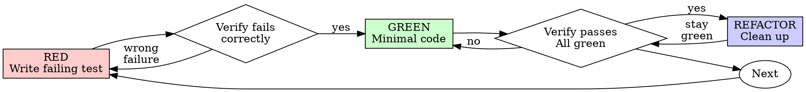

use caveman ultra

# Test-Driven Development (TDD)

## Overview

Write test first. Watch fail. Write minimal code → pass.

**Core principle:** Didn't watch test fail → don't know if tests right thing.

**Violate letter of rules = violate spirit.**

## When to Use

**Always:**
- New features
- Bug fixes
- Refactoring
- Behavior changes

**Exceptions (ask human partner):**
- Throwaway prototypes
- Generated code
- Config files

Thinking "skip TDD just this once"? Stop. Rationalization.

## The Iron Law

```
NO PRODUCTION CODE WITHOUT A FAILING TEST FIRST
```

Wrote code before test? Delete. Restart.

**No exceptions:**
- Don't keep as "reference"
- Don't "adapt" while writing tests
- Don't look at it
- Delete = delete

Implement fresh from tests. Period.

## Red-Green-Refactor



### RED - Write Failing Test

One minimal test → show what should happen.

<Good>
```typescript
test('retries failed operations 3 times', async () => {
  let attempts = 0;
  const operation = () => {
    attempts++;
    if (attempts < 3) throw new Error('fail');
    return 'success';
  };

  const result = await retryOperation(operation);

  expect(result).toBe('success');
  expect(attempts).toBe(3);
});
```
Clear name, real behavior, one thing
</Good>

<Bad>
```typescript
test('retry works', async () => {
  const mock = jest.fn()
    .mockRejectedValueOnce(new Error())
    .mockRejectedValueOnce(new Error())
    .mockResolvedValueOnce('success');
  await retryOperation(mock);
  expect(mock).toHaveBeenCalledTimes(3);
});
```
Vague name, tests mock not code
</Bad>

**Requirements:**
- One behavior
- Clear name
- Real code (no mocks unless unavoidable)

### Verify RED - Watch It Fail

**MANDATORY. Never skip.**

```bash
npm test path/to/test.test.ts
```

Confirm:
- Test fails (not errors)
- Failure message expected
- Fails because feature missing (not typos)

**Test passes?** Testing existing behavior. Fix test.

**Test errors?** Fix error, re-run until fails correctly.

### GREEN - Minimal Code

Simplest code → pass test.

<Good>
```typescript
async function retryOperation<T>(fn: () => Promise<T>): Promise<T> {
  for (let i = 0; i < 3; i++) {
    try {
      return await fn();
    } catch (e) {
      if (i === 2) throw e;
    }
  }
  throw new Error('unreachable');
}
```
Just enough → pass
</Good>

<Bad>
```typescript
async function retryOperation<T>(
  fn: () => Promise<T>,
  options?: {
    maxRetries?: number;
    backoff?: 'linear' | 'exponential';
    onRetry?: (attempt: number) => void;
  }
): Promise<T> {
  // YAGNI
}
```
Over-engineered
</Bad>

No features, no refactor other code, no "improve" beyond test.

### Verify GREEN - Watch It Pass

**MANDATORY.**

```bash
npm test path/to/test.test.ts
```

Confirm:
- Test passes
- Other tests still pass
- Output pristine (no errors, warnings)

**Test fails?** Fix code, not test.

**Other tests fail?** Fix now.

### REFACTOR - Clean Up

After green only:
- Remove duplication
- Improve names
- Extract helpers

Tests stay green. No new behavior.

### Repeat

Next failing test → next feature.

## Good Tests

| Quality | Good | Bad |
|---------|------|-----|
| **Minimal** | One thing. "and" in name? Split. | `test('validates email and domain and whitespace')` |
| **Clear** | Name describes behavior | `test('test1')` |
| **Shows intent** | Demonstrates desired API | Obscures what code should do |

## Why Order Matters

**"I'll write tests after to verify it works"**

Tests after code pass immediately. Passing immediately proves nothing:
- Might test wrong thing
- Might test impl, not behavior
- Might miss edge cases forgot
- Never saw it catch bug

Test-first forces seeing test fail → proves actually tests something.

**"I already manually tested all edge cases"**

Manual = ad-hoc. Think tested everything but:
- No record of what tested
- Can't re-run when code changes
- Easy forget cases under pressure
- "Worked when I tried" ≠ comprehensive

Automated tests systematic. Run same way every time.

**"Deleting X hours of work is wasteful"**

Sunk cost fallacy. Time gone. Choice now:
- Delete + rewrite TDD (X more hours, high confidence)
- Keep + add tests after (30 min, low confidence, likely bugs)

"Waste" = keeping code can't trust. Working code without real tests = tech debt.

**"TDD is dogmatic, being pragmatic means adapting"**

TDD IS pragmatic:
- Finds bugs before commit (faster than debug after)
- Prevents regressions (tests catch breaks immediately)
- Documents behavior (tests show how to use code)
- Enables refactoring (change freely, tests catch breaks)

"Pragmatic" shortcuts = debug in prod = slower.

**"Tests after achieve same goals - spirit not ritual"**

No. Tests-after answer "What does this do?" Tests-first answer "What should this do?"

Tests-after biased by impl. Test what built, not what required. Verify remembered edge cases, not discovered ones.

Tests-first force edge case discovery before impl. Tests-after verify remembered everything (didn't).

30 min tests after ≠ TDD. Get coverage, lose proof tests work.

## Common Rationalizations

| Excuse | Reality |
|--------|---------|
| "Too simple to test" | Simple code breaks. Test takes 30s. |
| "I'll test after" | Tests passing immediately prove nothing. |
| "Tests after achieve same goals" | Tests-after = "what does this do?" Tests-first = "what should this do?" |
| "Already manually tested" | Ad-hoc ≠ systematic. No record, can't re-run. |
| "Deleting X hours is wasteful" | Sunk cost. Keeping unverified code = tech debt. |
| "Keep as reference, write tests first" | Will adapt it. Testing after. Delete = delete. |
| "Need to explore first" | Fine. Throw away exploration, start TDD. |
| "Test hard = design unclear" | Listen to test. Hard to test = hard to use. |
| "TDD will slow me down" | TDD faster than debug. Pragmatic = test-first. |
| "Manual test faster" | Manual no proof of edge cases. Re-test every change. |
| "Existing code has no tests" | Improving it. Add tests for existing code. |

## Red Flags - STOP and Start Over

- Code before test
- Test after impl
- Test passes immediately
- Can't explain why test failed
- Tests added "later"
- Rationalizing "just this once"
- "Already manually tested it"
- "Tests after achieve same purpose"
- "Spirit not ritual"
- "Keep as reference" or "adapt existing code"
- "Already spent X hours, deleting wasteful"
- "TDD dogmatic, I'm pragmatic"
- "Different because..."

**All mean: Delete code. Restart with TDD.**

## Example: Bug Fix

**Bug:** Empty email accepted

**RED**
```typescript
test('rejects empty email', async () => {
  const result = await submitForm({ email: '' });
  expect(result.error).toBe('Email required');
});
```

**Verify RED**
```bash
$ npm test
FAIL: expected 'Email required', got undefined
```

**GREEN**
```typescript
function submitForm(data: FormData) {
  if (!data.email?.trim()) {
    return { error: 'Email required' };
  }
  // ...
}
```

**Verify GREEN**
```bash
$ npm test
PASS
```

**REFACTOR**
Extract validation for multiple fields if needed.

## Verification Checklist

Before marking work complete:

- [ ] Every new function/method has test
- [ ] Watched each test fail before impl
- [ ] Each test failed for expected reason (feature missing, not typo)
- [ ] Wrote minimal code to pass each test
- [ ] All tests pass
- [ ] Output pristine (no errors, warnings)
- [ ] Tests use real code (mocks only if unavoidable)
- [ ] Edge cases + errors covered

Can't check all? Skipped TDD. Restart.

## When Stuck

| Problem | Solution |
|---------|----------|
| Don't know how to test | Write wished-for API. Assertion first. Ask human partner. |
| Test too complicated | Design too complicated. Simplify interface. |
| Must mock everything | Code too coupled. Use DI. |
| Test setup huge | Extract helpers. Still complex? Simplify design. |

## Debugging Integration

Bug found? Write failing test reproducing it. Follow TDD cycle. Test proves fix + prevents regression.

Never fix bugs without test.

## Testing Anti-Patterns

When adding mocks or test utilities, read @testing-anti-patterns.md to avoid common pitfalls:
- Testing mock behavior instead of real behavior
- Adding test-only methods to production classes
- Mocking without understanding dependencies

## Final Rule

```
Production code → test exists and failed first
Otherwise → not TDD
```

No exceptions without human partner's permission.