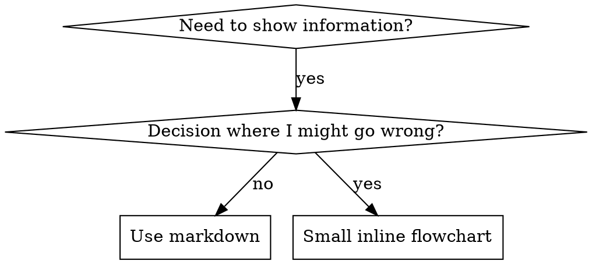

use caveman ultra

# Writing Skills

## Overview

**Writing skills IS Test-Driven Development applied to process documentation.**

**Personal skills live in agent-specific dirs (`~/.claude/skills` Claude Code, `~/.agents/skills/` Codex)**

Write test cases (pressure scenarios w/ subagents), watch fail (baseline), write skill (docs), watch pass (agents comply), refactor (close loopholes).

**Core principle:** No watch agent fail without skill → don't know if skill teaches right thing.

**REQUIRED BACKGROUND:** MUST understand superpowers:test-driven-development before this skill. Defines RED-GREEN-REFACTOR cycle. This skill adapts TDD to docs.

**Official guidance:** Anthropic's official skill authoring practices → anthropic-best-practices.md. Complements TDD approach here.

## What is a Skill?

**Skill** = reference guide for proven techniques, patterns, tools. Help future Claude find + apply.

**Skills are:** Reusable techniques, patterns, tools, reference guides

**Skills are NOT:** Narratives about how you solved a problem once

## TDD Mapping for Skills

| TDD Concept | Skill Creation |
|-------------|----------------|
| **Test case** | Pressure scenario with subagent |
| **Production code** | Skill document (SKILL.md) |
| **Test fails (RED)** | Agent violates rule without skill (baseline) |
| **Test passes (GREEN)** | Agent complies with skill present |
| **Refactor** | Close loopholes while maintaining compliance |
| **Write test first** | Run baseline scenario BEFORE writing skill |
| **Watch it fail** | Document exact rationalizations agent uses |
| **Minimal code** | Write skill addressing those specific violations |
| **Watch it pass** | Verify agent now complies |
| **Refactor cycle** | Find new rationalizations → plug → re-verify |

Whole skill creation follows RED-GREEN-REFACTOR.

## When to Create a Skill

**Create when:**
- Technique not intuitively obvious
- Reference again across projects
- Pattern broad (not project-specific)
- Others benefit

**Don't create for:**
- One-off solutions
- Standard practices documented elsewhere
- Project-specific conventions (→ CLAUDE.md)
- Mechanical constraints (enforceable w/ regex/validation → automate; docs for judgment calls only)

## Skill Types

### Technique
Concrete method w/ steps (condition-based-waiting, root-cause-tracing)

### Pattern
Way of thinking about problems (flatten-with-flags, test-invariants)

### Reference
API docs, syntax guides, tool docs (office docs)

## Directory Structure


```
skills/
  skill-name/
    SKILL.md              # Main reference (required)
    supporting-file.*     # Only if needed
```

**Flat namespace** — all skills one searchable namespace

**Separate files for:**
1. **Heavy reference** (100+ lines) — API docs, full syntax
2. **Reusable tools** — scripts, utilities, templates

**Keep inline:**
- Principles + concepts
- Code patterns (< 50 lines)
- Everything else

## SKILL.md Structure

**Frontmatter (YAML):**
- Two required fields: `name` and `description` (all supported fields → [agentskills.io/specification](https://agentskills.io/specification))
- Max 1024 chars total
- `name`: letters, numbers, hyphens only (no parens, special chars)
- `description`: third-person, ONLY when to use (NOT what it does)
  - Start with "Use when..." → trigger conditions
  - Specific symptoms, situations, contexts
  - **NEVER summarize skill process/workflow** (see CSO section)
  - Under 500 chars if possible

```markdown
---
name: Skill-Name-With-Hyphens
description: Use when [specific triggering conditions and symptoms]
---

# Skill Name

## Overview
What is this? Core principle in 1-2 sentences.

## When to Use
[Small inline flowchart IF decision non-obvious]

Bullet list with SYMPTOMS and use cases
When NOT to use

## Core Pattern (for techniques/patterns)
Before/after code comparison

## Quick Reference
Table or bullets for scanning common operations

## Implementation
Inline code for simple patterns
Link to file for heavy reference or reusable tools

## Common Mistakes
What goes wrong + fixes

## Real-World Impact (optional)
Concrete results
```


## Claude Search Optimization (CSO)

**Critical for discovery:** Future Claude must FIND skill

### 1. Rich Description Field

**Purpose:** Claude reads description → decide which skills load. Answer: "Read this skill now?"

**Format:** Start "Use when..." → trigger conditions

**CRITICAL: Description = When to Use, NOT What Skill Does**

Description ONLY trigger conditions. Do NOT summarize skill process/workflow.

**Why:** Testing showed → description summarizing workflow → Claude follows description instead of reading full skill. Description "code review between tasks" → Claude did ONE review, even though skill flowchart showed TWO (spec compliance then code quality).

Description changed → "Use when executing implementation plans with independent tasks" (no workflow summary) → Claude correctly read flowchart, followed two-stage review.

**Trap:** Descriptions summarizing workflow → shortcut Claude takes. Skill body → docs Claude skips.

```yaml
# ❌ BAD: Summarizes workflow - Claude may follow this instead of reading skill
description: Use when executing plans - dispatches subagent per task with code review between tasks

# ❌ BAD: Too much process detail
description: Use for TDD - write test first, watch it fail, write minimal code, refactor

# ✅ GOOD: Just triggering conditions, no workflow summary
description: Use when executing implementation plans with independent tasks in the current session

# ✅ GOOD: Triggering conditions only
description: Use when implementing any feature or bugfix, before writing implementation code
```

**Content:**
- Concrete triggers, symptoms, situations signaling skill applies
- Describe *problem* (race conditions, inconsistent behavior) not *language-specific symptoms* (setTimeout, sleep)
- Triggers technology-agnostic unless skill technology-specific
- Skill technology-specific → make explicit in trigger
- Third person (injected into system prompt)
- **NEVER summarize skill process/workflow**

```yaml
# ❌ BAD: Too abstract, vague, doesn't include when to use
description: For async testing

# ❌ BAD: First person
description: I can help you with async tests when they're flaky

# ❌ BAD: Mentions technology but skill isn't specific to it
description: Use when tests use setTimeout/sleep and are flaky

# ✅ GOOD: Starts with "Use when", describes problem, no workflow
description: Use when tests have race conditions, timing dependencies, or pass/fail inconsistently

# ✅ GOOD: Technology-specific skill with explicit trigger
description: Use when using React Router and handling authentication redirects
```

### 2. Keyword Coverage

Words Claude searches:
- Error messages: "Hook timed out", "ENOTEMPTY", "race condition"
- Symptoms: "flaky", "hanging", "zombie", "pollution"
- Synonyms: "timeout/hang/freeze", "cleanup/teardown/afterEach"
- Tools: actual commands, library names, file types

### 3. Descriptive Naming

**Active voice, verb-first:**
- ✅ `creating-skills` not `skill-creation`
- ✅ `condition-based-waiting` not `async-test-helpers`

### 4. Token Efficiency (Critical)

**Problem:** getting-started + frequently-referenced skills load EVERY conversation. Every token counts.

**Target word counts:**
- getting-started workflows: <150 words each
- Frequently-loaded skills: <200 words total
- Other skills: <500 words (still concise)

**Techniques:**

**Move details to tool help:**
```bash
# ❌ BAD: Document all flags in SKILL.md
search-conversations supports --text, --both, --after DATE, --before DATE, --limit N

# ✅ GOOD: Reference --help
search-conversations supports multiple modes and filters. Run --help for details.
```

**Use cross-references:**
```markdown
# ❌ BAD: Repeat workflow details
When searching, dispatch subagent with template...
[20 lines of repeated instructions]

# ✅ GOOD: Reference other skill
Always use subagents (50-100x context savings). REQUIRED: Use [other-skill-name] for workflow.
```

**Compress examples:**
```markdown
# ❌ BAD: Verbose example (42 words)
your human partner: "How did we handle authentication errors in React Router before?"
You: I'll search past conversations for React Router authentication patterns.
[Dispatch subagent with search query: "React Router authentication error handling 401"]

# ✅ GOOD: Minimal example (20 words)
Partner: "How did we handle auth errors in React Router?"
You: Searching...
[Dispatch subagent → synthesis]
```

**Eliminate redundancy:**
- Don't repeat cross-referenced skill content
- Don't explain what's obvious from command
- Don't include multiple examples of same pattern

**Verification:**
```bash
wc -w skills/path/SKILL.md
# getting-started workflows: aim for <150 each
# Other frequently-loaded: aim for <200 total
```

**Name by what you DO or core insight:**
- ✅ `condition-based-waiting` > `async-test-helpers`
- ✅ `using-skills` not `skill-usage`
- ✅ `flatten-with-flags` > `data-structure-refactoring`
- ✅ `root-cause-tracing` > `debugging-techniques`

**Gerunds (-ing) work for processes:**
- `creating-skills`, `testing-skills`, `debugging-with-logs`
- Active, describes action taken

### 4. Cross-Referencing Other Skills

**Writing docs referencing other skills:**

Skill name only, explicit requirement markers:
- ✅ Good: `**REQUIRED SUB-SKILL:** Use superpowers:test-driven-development`
- ✅ Good: `**REQUIRED BACKGROUND:** You MUST understand superpowers:systematic-debugging`
- ❌ Bad: `See skills/testing/test-driven-development` (unclear if required)
- ❌ Bad: `@skills/testing/test-driven-development/SKILL.md` (force-loads, burns context)

**Why no @ links:** `@` syntax force-loads files immediately, eats 200k+ context before need.

## Flowchart Usage



**Use flowcharts ONLY for:**
- Non-obvious decision points
- Process loops where might stop too early
- "When to use A vs B" decisions

**Never use flowcharts for:**
- Reference material → tables, lists
- Code examples → markdown blocks
- Linear instructions → numbered lists
- Labels w/o semantic meaning (step1, helper2)

See @graphviz-conventions.dot for graphviz style rules.

**Visualizing for human partner:** `render-graphs.js` in this dir → render skill flowcharts to SVG:
```bash
./render-graphs.js ../some-skill           # Each diagram separately
./render-graphs.js ../some-skill --combine # All diagrams in one SVG
```

## Code Examples

**One excellent example beats many mediocre ones**

Choose most relevant language:
- Testing techniques → TypeScript/JavaScript
- System debugging → Shell/Python
- Data processing → Python

**Good example:**
- Complete + runnable
- Well-commented explaining WHY
- From real scenario
- Shows pattern clearly
- Ready to adapt (not generic template)

**Don't:**
- Implement in 5+ languages
- Create fill-in-the-blank templates
- Write contrived examples

You're good at porting — one great example enough.

## File Organization

### Self-Contained Skill
```
defense-in-depth/
  SKILL.md    # Everything inline
```
When: All content fits, no heavy reference needed

### Skill with Reusable Tool
```
condition-based-waiting/
  SKILL.md    # Overview + patterns
  example.ts  # Working helpers to adapt
```
When: Tool reusable code, not narrative

### Skill with Heavy Reference
```
pptx/
  SKILL.md       # Overview + workflows
  pptxgenjs.md   # 600 lines API reference
  ooxml.md       # 500 lines XML structure
  scripts/       # Executable tools
```
When: Reference material too large for inline

## The Iron Law (Same as TDD)

```
NO SKILL WITHOUT A FAILING TEST FIRST
```

Applies to NEW skills AND EDITS to existing skills.

Skill before testing? Delete. Start over.
Edit skill without testing? Same violation.

**No exceptions:**
- Not "simple additions"
- Not "just adding section"
- Not "doc updates"
- Don't keep untested changes as "reference"
- Don't "adapt" while running tests
- Delete means delete

**REQUIRED BACKGROUND:** superpowers:test-driven-development skill explains why. Same principles apply to docs.

## Testing All Skill Types

Different skill types → different test approaches:

### Discipline-Enforcing Skills (rules/requirements)

**Examples:** TDD, verification-before-completion, designing-before-coding

**Test with:**
- Academic questions: understand rules?
- Pressure scenarios: comply under stress?
- Combined pressures: time + sunk cost + exhaustion
- Identify rationalizations → add explicit counters

**Success criteria:** Agent follows rule under max pressure

### Technique Skills (how-to guides)

**Examples:** condition-based-waiting, root-cause-tracing, defensive-programming

**Test with:**
- Application scenarios: apply technique correctly?
- Variation scenarios: handle edge cases?
- Missing info tests: instructions have gaps?

**Success criteria:** Agent applies technique to new scenario

### Pattern Skills (mental models)

**Examples:** reducing-complexity, information-hiding concepts

**Test with:**
- Recognition scenarios: recognize when pattern applies?
- Application scenarios: use mental model?
- Counter-examples: know when NOT to apply?

**Success criteria:** Agent identifies when/how to apply pattern

### Reference Skills (docs/APIs)

**Examples:** API docs, command refs, library guides

**Test with:**
- Retrieval scenarios: find right info?
- Application scenarios: use correctly?
- Gap testing: common use cases covered?

**Success criteria:** Agent finds + applies reference info correctly

## Common Rationalizations for Skipping Testing

| Excuse | Reality |
|--------|---------|
| "Skill is obviously clear" | Clear to you ≠ clear to other agents. Test it. |
| "It's just a reference" | References can have gaps, unclear sections. Test retrieval. |
| "Testing is overkill" | Untested skills have issues. Always. 15 min testing saves hours. |
| "I'll test if problems emerge" | Problems = agents can't use skill. Test BEFORE deploying. |
| "Too tedious to test" | Testing is less tedious than debugging bad skill in production. |
| "I'm confident it's good" | Overconfidence guarantees issues. Test anyway. |
| "Academic review is enough" | Reading ≠ using. Test application scenarios. |
| "No time to test" | Deploying untested skill wastes more time fixing it later. |

**All mean: Test before deploying. No exceptions.**

## Bulletproofing Skills Against Rationalization

Discipline skills (like TDD) → resist rationalization. Agents smart, find loopholes under pressure.

**Psychology note:** Understand WHY persuasion techniques work → apply systematically. See persuasion-principles.md for research foundation (Cialdini, 2021; Meincke et al., 2025) on authority, commitment, scarcity, social proof, unity.

### Close Every Loophole Explicitly

Don't state rule — forbid specific workarounds:

<Bad>
```markdown
Write code before test? Delete it.
```
</Bad>

<Good>
```markdown
Write code before test? Delete it. Start over.

**No exceptions:**
- Don't keep it as "reference"
- Don't "adapt" it while writing tests
- Don't look at it
- Delete means delete
```
</Good>

### Address "Spirit vs Letter" Arguments

Add foundational principle early:

```markdown
**Violating the letter of the rules is violating the spirit of the rules.**
```

Cuts entire class of "following spirit" rationalizations.

### Build Rationalization Table

Capture rationalizations from baseline testing (see Testing section). Every excuse → table:

```markdown
| Excuse | Reality |
|--------|---------|
| "Too simple to test" | Simple code breaks. Test takes 30 seconds. |
| "I'll test after" | Tests passing immediately prove nothing. |
| "Tests after achieve same goals" | Tests-after = "what does this do?" Tests-first = "what should this do?" |
```

### Create Red Flags List

Easy for agents to self-check when rationalizing:

```markdown
## Red Flags - STOP and Start Over

- Code before test
- "I already manually tested it"
- "Tests after achieve the same purpose"
- "It's about spirit not ritual"
- "This is different because..."

**All of these mean: Delete code. Start over with TDD.**
```

### Update CSO for Violation Symptoms

Add to description: symptoms when ABOUT to violate rule:

```yaml
description: use when implementing any feature or bugfix, before writing implementation code
```

## RED-GREEN-REFACTOR for Skills

Follow TDD cycle:

### RED: Write Failing Test (Baseline)

Run pressure scenario w/ subagent WITHOUT skill. Document exact behavior:
- What choices made?
- What rationalizations used (verbatim)?
- Which pressures triggered violations?

This = "watch test fail" — must see what agents naturally do before writing skill.

### GREEN: Write Minimal Skill

Skill addressing those rationalizations. No extra content for hypothetical cases.

Run same scenarios WITH skill. Agent should comply.

### REFACTOR: Close Loopholes

Agent finds new rationalization? Add explicit counter. Re-test until bulletproof.

**Testing methodology:** See @testing-skills-with-subagents.md for full methodology:
- How to write pressure scenarios
- Pressure types (time, sunk cost, authority, exhaustion)
- Plug holes systematically
- Meta-testing techniques

## Anti-Patterns

### ❌ Narrative Example
"In session 2025-10-03, we found empty projectDir caused..."
**Why bad:** Too specific, not reusable

### ❌ Multi-Language Dilution
example-js.js, example-py.py, example-go.go
**Why bad:** Mediocre quality, maintenance burden

### ❌ Code in Flowcharts
```dot
step1 [label="import fs"];
step2 [label="read file"];
```
**Why bad:** Can't copy-paste, hard to read

### ❌ Generic Labels
helper1, helper2, step3, pattern4
**Why bad:** Labels need semantic meaning

## STOP: Before Moving to Next Skill

**After writing ANY skill, MUST STOP + complete deployment.**

**Do NOT:**
- Create multiple skills batch without testing each
- Move to next skill before current verified
- Skip testing because "batching is more efficient"

**Deployment checklist below MANDATORY for EACH skill.**

Deploying untested skills = deploying untested code. Quality violation.

## Skill Creation Checklist (TDD Adapted)

**IMPORTANT: Use TodoWrite → todos for EACH item below.**

**RED Phase - Write Failing Test:**
- [ ] Create pressure scenarios (3+ combined pressures for discipline skills)
- [ ] Run scenarios WITHOUT skill - document baseline behavior verbatim
- [ ] Identify patterns in rationalizations/failures

**GREEN Phase - Write Minimal Skill:**
- [ ] Name uses only letters, numbers, hyphens (no parentheses/special chars)
- [ ] YAML frontmatter with required `name` and `description` fields (max 1024 chars; see [spec](https://agentskills.io/specification))
- [ ] Description starts with "Use when..." and includes specific triggers/symptoms
- [ ] Description written in third person
- [ ] Keywords throughout for search (errors, symptoms, tools)
- [ ] Clear overview with core principle
- [ ] Address specific baseline failures identified in RED
- [ ] Code inline OR link to separate file
- [ ] One excellent example (not multi-language)
- [ ] Run scenarios WITH skill - verify agents now comply

**REFACTOR Phase - Close Loopholes:**
- [ ] Identify NEW rationalizations from testing
- [ ] Add explicit counters (if discipline skill)
- [ ] Build rationalization table from all test iterations
- [ ] Create red flags list
- [ ] Re-test until bulletproof

**Quality Checks:**
- [ ] Small flowchart only if decision non-obvious
- [ ] Quick reference table
- [ ] Common mistakes section
- [ ] No narrative storytelling
- [ ] Supporting files only for tools or heavy reference

**Deployment:**
- [ ] Commit skill to git and push to your fork (if configured)
- [ ] Consider contributing back via PR (if broadly useful)

## Discovery Workflow

How future Claude finds skill:

1. **Encounters problem** ("tests are flaky")
3. **Finds SKILL** (description matches)
4. **Scans overview** (relevant?)
5. **Reads patterns** (quick reference table)
6. **Loads example** (only when implementing)

**Optimize for this flow** — searchable terms early + often.

## The Bottom Line

**Creating skills IS TDD for process documentation.**

Same Iron Law: No skill without failing test first.
Same cycle: RED (baseline) → GREEN (write skill) → REFACTOR (close loopholes).
Same benefits: Better quality, fewer surprises, bulletproof results.

Follow TDD for code → follow for skills. Same discipline, applied to docs.